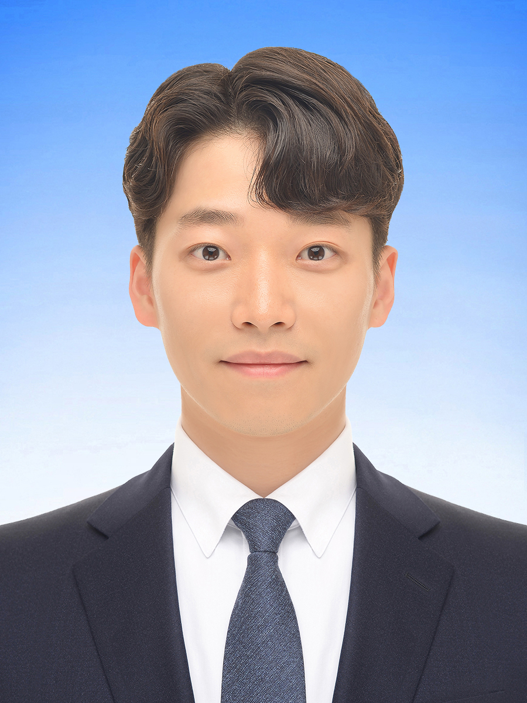

## Img

## About Me

I am a Ph.D. student at ...

## Research Interests

- **Computer Vision:** image recognition, image generation, video captioning
- **Machine Learning:** meta-learning, incremental learning, transfer learning

## News

- **[Feb. 2020]** Our paper about incremental learning is accepted to CVPR 2020.
- **[Feb. 2020]** We will host the ACM Multimedia Asia 2020 conference in Singapore!
- **[Sept. 2019]** Our paper about few-shot learning is accepted to NeurIPS 2019.
- **[Mar. 2019]** Our paper about few-shot learning is accepted to CVPR 2019.




